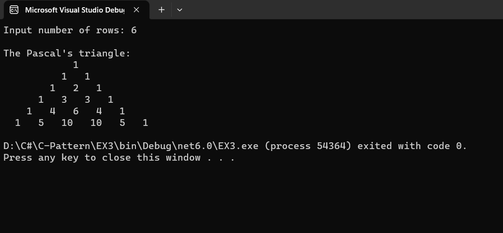

# Pattern

## Aim:
To write a C# program for a pascal's triangle.

## Equipment Required:
Microsoft Visual Studio 2022

## Algorithm:
1. Start the program.
2. Get the limit from the user.
3. Use for loop to print the rows , columns and space.
4. Use if-else condition inside the loop to print the values.
5. Use c = c * (i - j + 1) / j to print the inner value.
6. Using Console.write print the Pascal's triangle.
7. End the program.

## Program:
```
DEVELOPED BY : SUDHARSHNA LAKSHMI S
REGISTER NO : 212221230110
```
```
using System;
public class EX3
{
    public static void Main()
    {
        int no_row, c = 1, k, i, j;
        Console.Write("Input number of rows: ");
        no_row = Convert.ToInt32(Console.ReadLine());
        Console.Write("\nThe Pascal's triangle:\n");
        for (i = 0; i < no_row; i++)
        {
            for (k = 1; k <= no_row - i; k++)
                Console.Write("  ");
            for (j = 0; j <= i; j++)
            {
                if (j == 0 || i == 0)
                    c = 1;
                else
                    c = c * (i - j + 1) / j;
                Console.Write("{0}   ", c);
            }
            Console.Write("\n");
        }
    }
}
```

## Output:


## Result:
A C# program for a pascal's triangle is executed successfully.